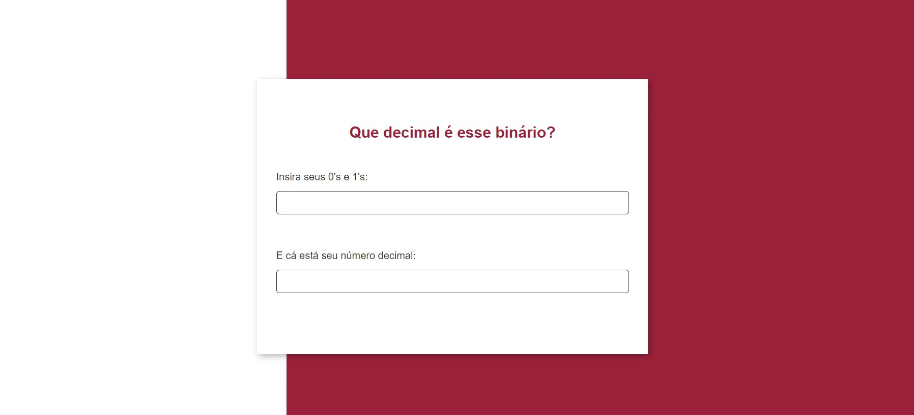

<h1 align="center">Conversor de Binário para Decimal</h1>
<h6 align="center"> 🎉  Finalizado!  🎉</h6>
 

 <a href="#-sobre-o-projeto">Sobre o projeto</a> •
 <a href="#-funcionalidades">Funcionalidades</a> •
 <a href="#-como-executar">Como executar</a> •
 <a href="#-autora">Autora</a> •
 <a href="#-licença">Licença</a>

## 💻 Sobre o projeto

Um conversor de binário para decimal inspirado no desafio do [repositório do Florin Pop](https://github.com/florinpop17/app-ideas).
Aprendi a utilizar melhor o `map` e o `reduce`, deixando meu código mais funcional.

## ⚙ Funcionalidades

- [x] o usuário é avisado quando um carácter diferente de 0 ou 1 é inserido no input;
- [x] o último carácter não aceito é imediatamente deletado do input;
- [x] o valor decimal é mostrado no output conforme o usuário digita.

## 🚀 Como executar

A aplicação está publicada [neste link](https://f-ernanda.github.io/conversor-binario-decimal/).

## 🦸 Autora

**Fernanda Silva**

 [GitHub][github] | [LinkedIn][linkedin]

<!-- Links -->
[github]: https://github.com/f-ernanda
[linkedin]:  https://f-ernanda.github.io/conversor-binario-decimal/

## 📝 Licença

Este projeto esta sob a licença [MIT](LICENSE).

---

Feito com ❤️ por Fernanda Silva  
[Entre em contato!](https://f-ernanda.github.io/conversor-binario-decimal/)