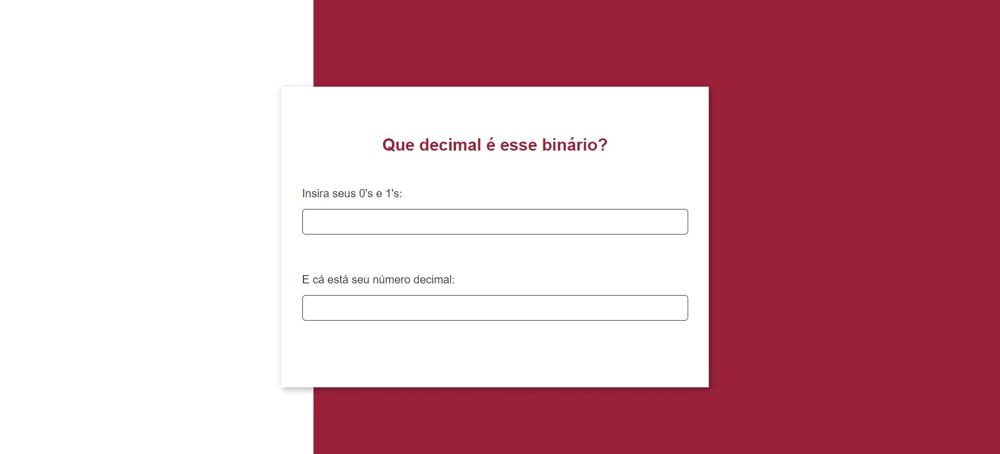

<h1 align="center">Conversor de Números</h1>

Um conversor simples de números binários para decimais.

  

  <!-- license -->
  
  <!-- languages -->
  
  <!-- top language-->
  

## 💻 Sobre o projeto

Este projeto foi criado a partir de um dos desafios do [repositório do Florin Pop](https://github.com/florinpop17/app-ideas).

Trata-se de uma pequena aplicação web que converte números binários em seus respectivos valores decimais. A aplicação também valida o input do usuário em tempo real e atualiza o resultado à medida que o usuário digita.

O projeto foi desenvolvido como um exercício prático de JavaScript, com foco no uso de métodos de arrays para transformar e processar os dados de forma mais funcional.

## 📃 Licença

Este projeto está licenciado sob a licença MIT. Consulte o arquivo [LICENSE](./LICENSE) para mais informações.

---

🌱 Criado por [Fernanda](https://github.com/f-ernanda)
